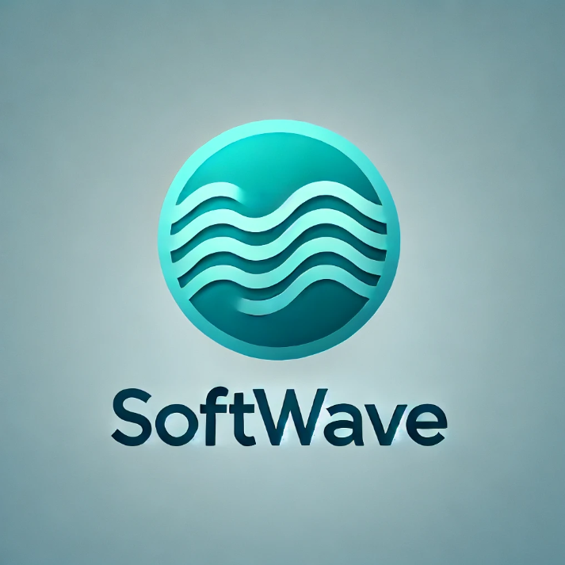

# Olá, seja bem-vindo(a) à nossa organização! 👋  

  

## Sobre a Softwave  

A **Softwave** 

---

### ⚖️ Sobre a Lauriano & Leão.  

  

## 🦉 Equipe  

Aqui estão os membros da nossa equipe:  

👨‍🚀 [Ana Claudia](https://github.com/anacampaner)  
👨‍🚀 [Bryan Ferro](https://github.com/Brzenit)  
👨‍🚀 [Cristhian Lauriano](https://github.com/Lauriano2003)  
👨‍🚀 [Luana Cruz](https://github.com/lualuaSantosS2)  
👨‍🚀 [Leticia Fonseca](https://github.com/letfonsecaa)  
👨‍🚀 [Leonardo Carvalho](https://github.com/LeonardooCarvalhoSantos)

##  Missão, Visão e Valores  

**Missão:**

**Visão:** 

**Valores:** 

• **Empatia** - 
• **Compromisso com a Qualidade e Ética** - 
• **Inovação** - 
